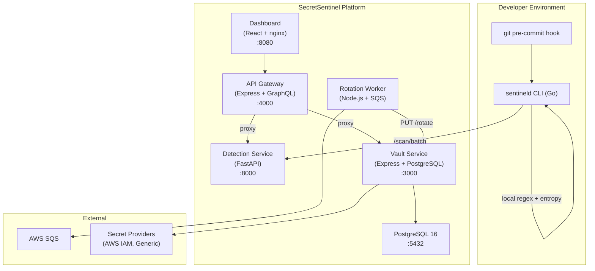

# SecretSentinel

Enterprise-grade secrets security platform: developer pre-commit protection, automated detection, encrypted vault, rotation, and observability.

## Architecture



## Monorepo Layout

| Path | Service | Language |
|------|---------|----------|
| `cli/` | `sentineld` CLI — git pre-commit scanner | Go 1.22 |
| `detection/` | Detection microservice — regex, entropy, confidence | Python 3.12 / FastAPI |
| `vault/` | Vault service — AES-256-GCM encrypted secret store | Node 22 / Express |
| `vault/sdk/` | `@sentineldev/sdk` — fetch/inject secrets from vault | TypeScript |
| `api/` | API gateway — REST + GraphQL proxy, JWT auth | Node 22 / Express + Apollo |
| `rotation/` | Rotation worker — SQS-triggered secret rotation | Node 22 |
| `dashboard/` | Management UI | React 19 / Vite / Tailwind |
| `infra/` | Docker Compose stacks + Terraform stubs | — |

## Quick Start (Development)

```bash
cp .env.example .env
# Fill in POSTGRES_PASSWORD, VAULT_AUTH_SECRET, VAULT_ENCRYPTION_KEY, JWT_SECRET

cd infra && docker compose up -d
```

Services start on:

| Service | URL |
|---------|-----|
| Dashboard | http://localhost:8080 |
| API Gateway | http://localhost:4000 |
| Detection | http://localhost:8000 |
| Vault | http://localhost:3000 |
| PostgreSQL | localhost:5432 |

## Production Deployment

```bash
cp .env.example .env   # fill in all required secrets
cd infra && docker compose -f docker-compose.prod.yml up -d
```

The production compose includes all six services with:
- Resource limits (CPU + memory) per service
- Network isolation (frontend / backend networks)
- Structured JSON logging via Docker json-file driver with rotation
- Deep health checks (vault verifies DB connectivity)
- Graceful shutdown (SIGTERM handlers on all Node services)

### Production Checklist

- [ ] TLS termination via reverse proxy (nginx/Caddy) in front of port 4000 and 8080
- [ ] Set strong values for `POSTGRES_PASSWORD`, `VAULT_AUTH_SECRET`, `VAULT_ENCRYPTION_KEY`, `JWT_SECRET`
- [ ] Configure `ALLOWED_ORIGINS` to your actual frontend domain
- [ ] Set `SQS_ROTATION_QUEUE_URL` if using secret rotation
- [ ] Configure PostgreSQL backups (e.g. pg_dump cron or AWS RDS automated backups)
- [ ] Set up Prometheus scraping on `/metrics` endpoints (vault :3000, API :4000, rotation :9090)
- [ ] Enable `SENTINEL_ENABLE_VALIDATION=1` only if network egress to providers is allowed

## Environment Variables

### Required

| Variable | Used by | Description |
|----------|---------|-------------|
| `POSTGRES_PASSWORD` | vault, db | PostgreSQL password |
| `VAULT_AUTH_SECRET` | vault, rotation | HMAC secret for tenant auth tokens |
| `VAULT_ENCRYPTION_KEY` | vault | AES-256-GCM key for at-rest encryption |
| `JWT_SECRET` | api | HMAC-SHA256 secret for verifying JWTs |

### Optional

| Variable | Default | Description |
|----------|---------|-------------|
| `ALLOWED_ORIGINS` | `http://localhost:8080` | CORS allowed origins (comma-separated) |
| `SENTINEL_CLI_TOKEN` | — | Bearer token CLI sends to detection service |
| `SENTINEL_DETECTION_URL` | — | Detection service URL for CLI remote scan |
| `SENTINEL_MIN_CONFIDENCE` | `0.5` | Minimum confidence threshold (0.0–1.0) |
| `SENTINEL_DISABLED_RULES` | — | Comma-separated rule IDs to disable |
| `SENTINEL_ENABLE_VALIDATION` | — | Set to `1` to enable live secret validation |
| `SQS_ROTATION_QUEUE_URL` | — | SQS queue URL for rotation events |
| `AWS_REGION` | `us-east-1` | AWS region for SQS/IAM |

## CLI Usage

```bash
# Install pre-commit hook in current git repo
sentineld init

# Scan staged changes (called automatically by pre-commit hook)
sentineld scan --staged

# Scan a directory
sentineld scan --path ./src

# Scan with JSON output (for CI)
sentineld scan --path . --json

# Use remote detection service
SENTINEL_DETECTION_URL=http://localhost:8000 sentineld scan --staged
```

Inline ignore: append `# sentineld:ignore` to any line to suppress findings for that line.

## Detection API

| Endpoint | Method | Description |
|----------|--------|-------------|
| `/health` | GET | Health status with rule count |
| `/ready` | GET | Readiness probe |
| `/scan` | POST | Scan a single file's content |
| `/scan/batch` | POST | Scan multiple files in one request |
| `/validate` | POST | Check if a secret is still live |
| `/metrics` | GET | Prometheus metrics |

**Rate limits:** `/scan` 100/min, `/scan/batch` 50/min, `/validate` 20/min (per IP).

## Vault API

| Endpoint | Method | Description |
|----------|--------|-------------|
| `/health` | GET | Health + DB connectivity check |
| `/ready` | GET | Readiness probe |
| `/metrics` | GET | Prometheus metrics |
| `/secrets/:env` | GET | List secret keys for env |
| `/secrets/:env` | POST | Create/update a secret |
| `/secrets/:env/:key` | GET | Read a secret value |
| `/secrets/:env/:key` | DELETE | Delete a secret |
| `/secrets/:env/:key/rotate` | PUT | Rotate a secret |
| `/secrets/:env/:key/versions` | GET | List secret version history |
| `/audit/:env` | GET | Retrieve audit log for env |

Authentication: `Authorization: Bearer <tenant>.<HMAC-SHA256-sig>` or `X-Sentinel-Token`.

## API Gateway (REST + GraphQL)

REST proxy: `/api/scan`, `/api/validate` → detection; `/api/vault/*` → vault  
GraphQL: `POST /graphql` — schema covers `scan`, `secretKeys`, `secret`, `setSecret`, `rotateSecret`, `validateSecret`

Authentication: `Authorization: Bearer <JWT>` (HMAC-SHA256, signed with `JWT_SECRET`).

## SDK Usage

```typescript
import { SecretSentinel } from "@sentineldev/sdk";

const sentinel = new SecretSentinel({
  token: process.env.SENTINEL_TOKEN,
  baseUrl: process.env.SENTINEL_VAULT_URL,
});

// Fetch a single secret
const apiKey = await sentinel.get("STRIPE_API_KEY", { env: "prod" });

// Inject multiple secrets into process.env
await sentinel.inject(["DB_PASSWORD", "REDIS_URL"], { env: "prod" });
```

## Observability

Each service exposes `/metrics` (Prometheus format):

| Service | Metrics endpoint |
|---------|-----------------|
| Detection | `:8000/metrics` |
| Vault | `:3000/metrics` |
| API Gateway | `:4000/metrics` |
| Rotation | `:9090/metrics` |

Key metrics: `secrets_detected_total`, `vault_secret_operations_total`, `vault_http_request_duration_seconds`, `api_gateway_proxy_errors_total`, `rotation_successes_total`, `rotation_failures_total`.

## CI Pipeline

GitHub Actions jobs: `cli` → `detection` → `vault-test` → `api-test` → `rotation-test` → `sdk-test` → `dashboard-build` → `build` → `security`

Security job: Trivy image scanning (CRITICAL/HIGH CVEs), gitleaks, SBOM generation.

## Development

```bash
# CLI tests
cd cli && go test -cover ./...

# Detection tests + lint
cd detection && pip install -e ".[dev]" && ruff check app/ && mypy app/ && pytest tests/ -v

# Vault tests
cd vault && npm install && npm test

# API tests
cd api && npm install && npm test

# Rotation tests
cd rotation && npm install && npm test

# Dashboard tests
cd dashboard && npm install && npm test

# Build CLI binary
make build-cli
```

## Troubleshooting

**Vault fails to start:** Ensure `POSTGRES_PASSWORD`, `VAULT_AUTH_SECRET`, and `VAULT_ENCRYPTION_KEY` are set.

**Detection returns 422:** Content exceeds 1 MB limit or filename exceeds 4096 bytes.

**API Gateway returns 429:** Rate limit exceeded (200 req/min per IP). Configurable via code.

**Rotation worker is idle:** `SQS_ROTATION_QUEUE_URL` not set — worker runs in stub mode.

**CLI scan slow:** `SENTINEL_DETECTION_URL` is set but service is unreachable; scan falls back to local detection only after 30s timeout. Set `SENTINEL_REMOTE_TIMEOUT_SECONDS=5` for faster fallback.
